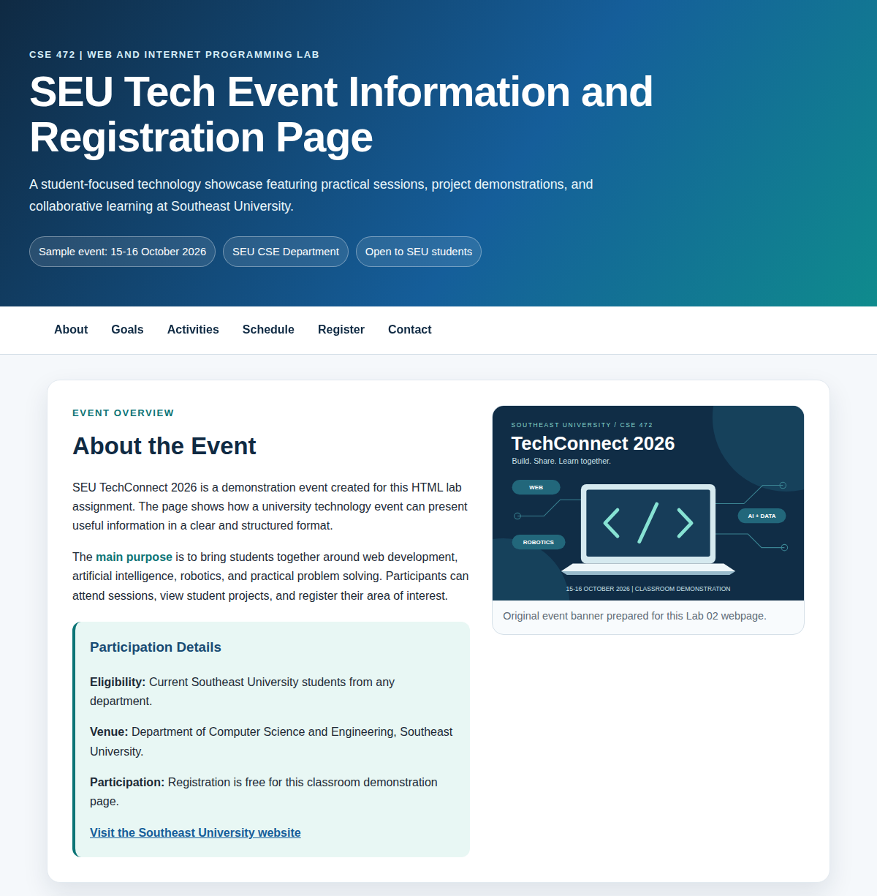
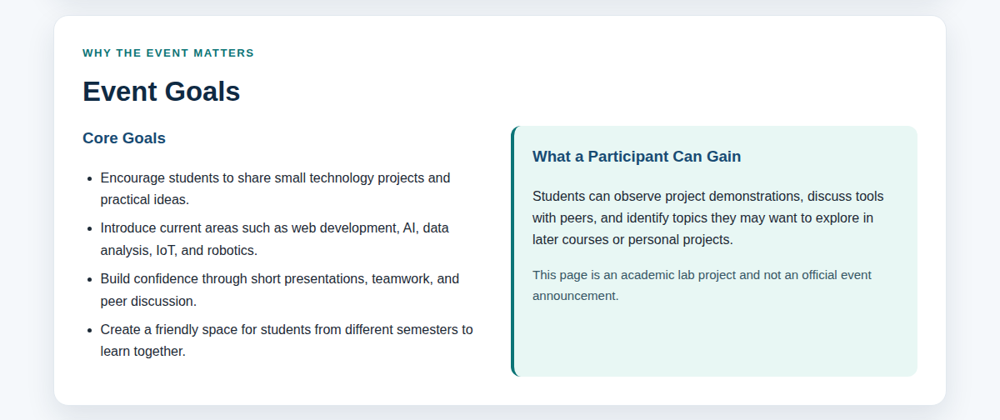
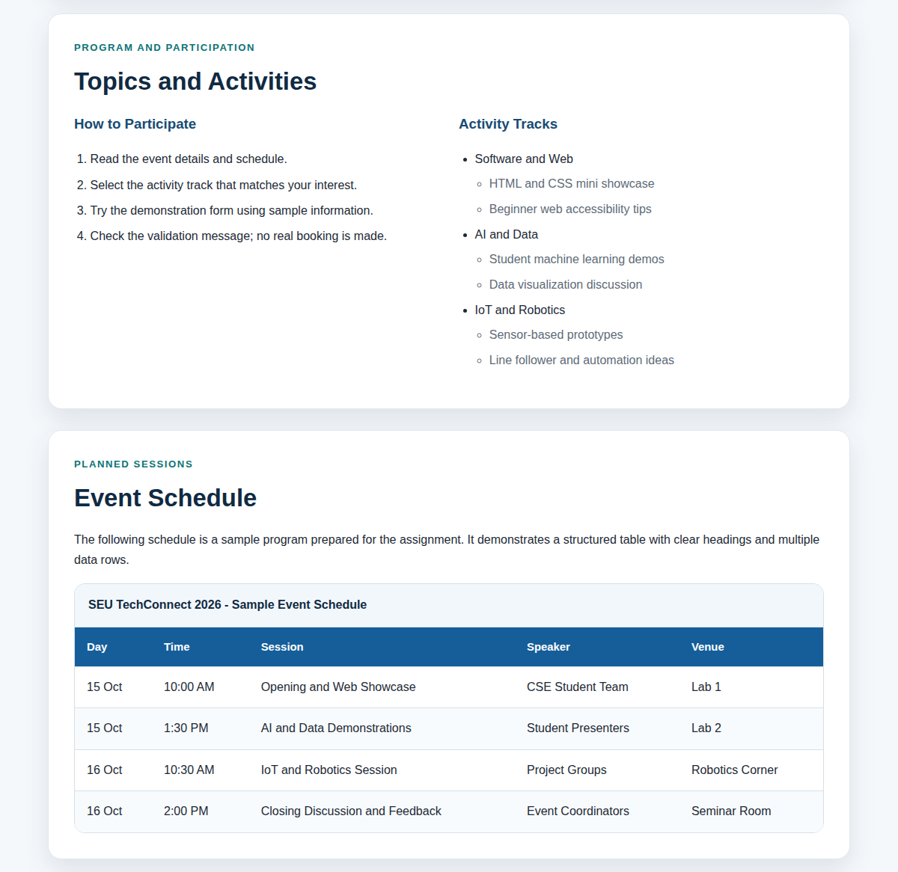
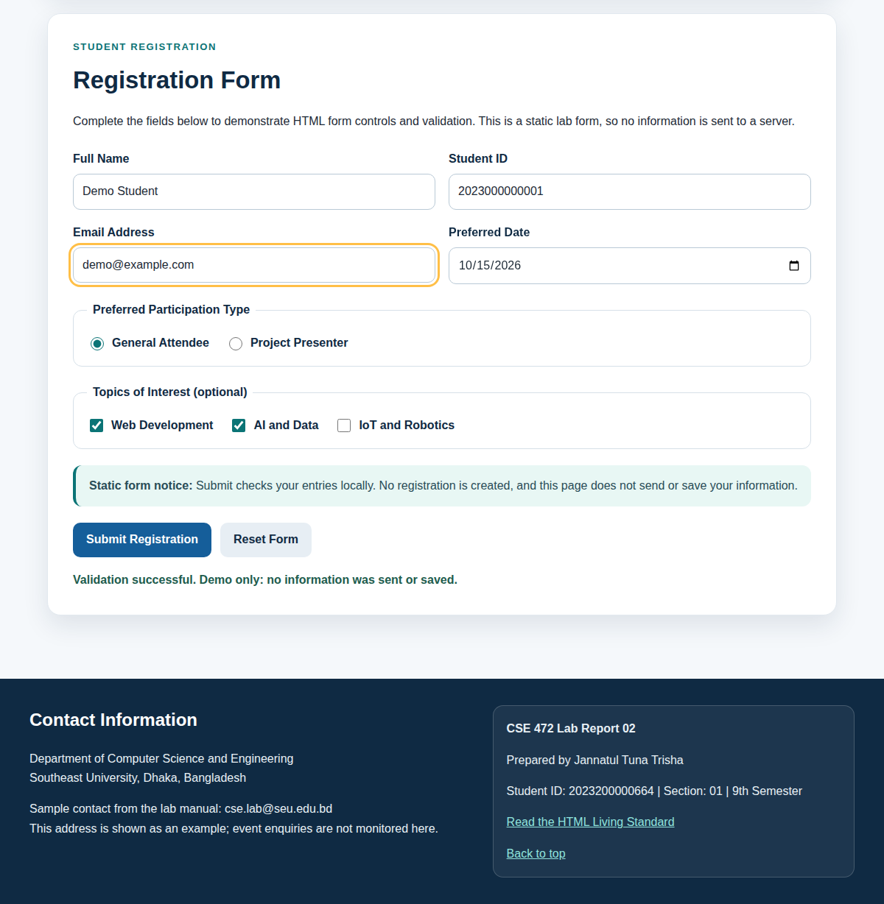
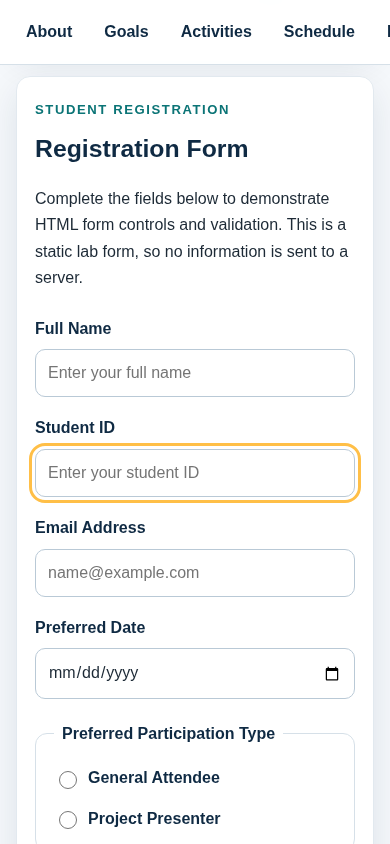

# CSE 472 - Lab Report 02
## HTML Fundamentals and Structured Webpage Development

**Assignment: SEU Tech Event Information and Registration Page**

| Student field | Value |
|---|---|
| Name | Jannatul Tuna Trisha |
| Student ID | 2023200000664 |
| Section | 01 |
| Semester | 9th |
| Department | Computer Science and Engineering |
| University | Southeast University |
| Course | CSE 472 - Web and Internet Programming Lab |
| Instructor | Abid Ahmad |
| Submission date | 8 September 2026 |

## Description and features
The single-page project applies the manual's final task: HTML5 metadata, one h1, semantic header/navigation/main/five sections/footer, meaningful div/span, safe links, a local image, ordered/unordered/nested lists, a five-column schedule with four data rows, and nine explicitly labelled registration inputs. External CSS provides cards, responsive fields, a scrollable table, keyboard focus and reduced-motion support. No CSS framework is used.

The event dates, rooms and programme are classroom examples, not an official university announcement. The contact address is taken from the manual and labelled as an example. The ID constraint of 10-15 digits is an example rule, not university policy.

## Run the website
Open `index.html` in a modern browser. All page resources are local; internet access is needed only to follow external hyperlinks. No build step or package installation is needed just to view the website.

Alternatively, from this folder run `python -m http.server 8000`, then open `http://127.0.0.1:8000/`. A GitHub source folder is not automatically a deployed website.

## Static form limitation
The form is a demonstration, not a registration service. HTML constraints check entries. `form-demo.js` cancels valid submission, displays feedback and does not send or save information. Submit starts disabled and is enabled only after the handlers are installed. It stays disabled without JavaScript. Reset restores default field values. Use fictitious values when testing.

## Actual testing summary
The final run used **Chromium 143.0.7499.4** against a **real local HTTP server in GitHub Actions**. Results: **33 passed, 0 blocked, 0 failed** across 33 checks. See [the full table](tests/TEST_RESULTS.md) and [raw results](tests/results.json).

The suite covers markup, CSS syntax/support, local references and real HTTP asset loading, image rendering, internal links, safe external links, native validation, radio/checkbox behaviour, Submit, Enter, Reset, labels, keyboard focus, no-JavaScript fallback, table scrolling and widths of 1200/820/390/320 pixels. No console or page error is claimed absent unless the recorded check passes. An unavailable external destination is marked BLOCKED rather than PASS.

During initial local development, the execution environment blocked direct file and loopback access. The final served-page run is separate from that preview test. No official W3C validation certificate, cross-browser, physical-phone or full screen-reader test is claimed.

## Project structure
```text
lab-02-html/
|-- index.html
|-- style.css
|-- form-demo.js
|-- images/event-banner.svg
|-- screenshots/ (five PNG browser captures)
|-- report/
|   |-- lab_report_02.tex
|   |-- build-metadata.tex
|   |-- test-cases.tex
|   `-- lab_report_02.pdf
|-- tests/
|   |-- results.json
|   |-- TEST_RESULTS.md
|   `-- build-status.json
|-- build_submission.py
|-- README.md
|-- SHA256SUMS.txt
`-- CSE472_Lab_02_Complete.zip
```

## LaTeX compilation
The compiled report has **27 pages** and includes the complete final HTML, CSS and safety helper. Keep the whole folder structure so relative listing/image paths resolve. In `report/`, run:
```bash
latexmk -pdf -interaction=nonstopmode -halt-on-error lab_report_02.tex
```
No shell escape is required. TeX Live needs the standard LaTeX packages, listings and lmodern.

## Reproduce the complete submission
The build script runs only within this Lab 02 folder. It preserves the original HTML/CSS design and refuses to patch an unexpected initial HTML version. It tests, captures screenshots, generates the report, compiles it three times, creates checksums and verifies the archive.
```bash
python -m pip install playwright==1.57.0 beautifulsoup4==4.14.3 tinycss2==1.5.1
python -m playwright install --with-deps chromium
python build_submission.py
```
Python 3.13, Node.js, pdfLaTeX and pdfinfo are also required. Normal local HTTP navigation must be permitted. `.github/workflows/lab-02-build.yml` provides the same build on GitHub.

## Screenshot previews
All five images are genuine browser captures. The successful form screenshot uses fictitious registration values.







## Image attribution
`images/event-banner.svg` is an original vector illustration made for this Lab 02 submission, using simple shapes and text. It is also used as the local favicon. It contains no third-party photograph, university logo or distributed font file, and is not a real campus photo.

## Submission contents and archive checks
The ZIP contains the HTML, CSS, helper, local SVG, five screenshots, complete LaTeX source with generated tables, compiled PDF, README, reproducible build script, actual test results and SHA-256 manifest. The ZIP excludes itself, `.git`, caches, temporary compilation files and unrelated repository files. The build prints every member, checks ZIP CRCs, extracts into a temporary folder and compares all extracted bytes with their source files.
